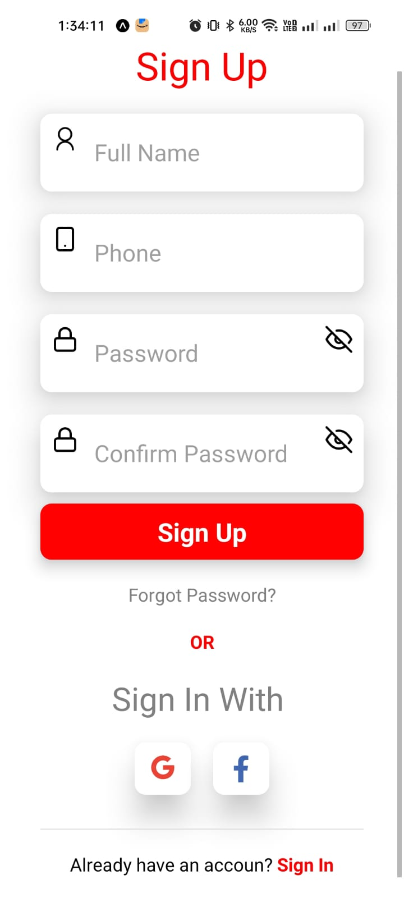
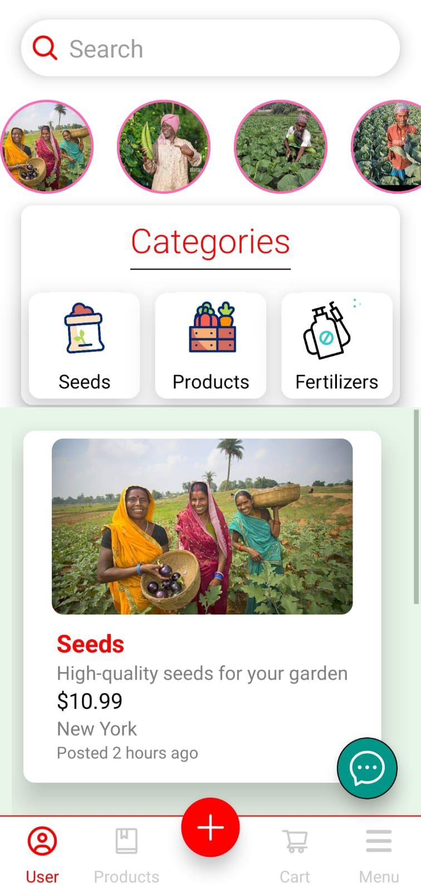

# FARM-MART

**FARM-MART** is a React Native mobile application built with **Expo Go** to facilitate farmers in selling seeds, crops, and fertilizers through an intuitive interface.

---

<p align="center">
  
  
  
  
</p>

---

## 🚀 Features

- **User Authentication**: Secure Sign In and Sign Up
- **Product Listings**: View categorized products (seeds, crops, fertilizers)
- **Search & Filter**: Easily find desired products
- **Cart & Checkout**: Add items to the cart and proceed to purchase
- **Order History**: View past purchases
- **User-Friendly UI**: Intuitive navigation and seamless experience

---

## 📦 Installation

### 1️⃣ Clone the Repository
```sh
 git clone https://github.com/pawan1-tech/farm-Market.git
 cd farm-mart
```

### 2️⃣ Install Dependencies
```sh
 npm install
```

### 3️⃣ Start the App with Expo Go
```sh
 expo start
```

- **Scan the QR Code** with Expo Go on your mobile device to run the app.

---


## 🎯 Future Enhancements
- **Dark Mode Support** 🌙
- **Multi-language Support** 🌍
- **Live Chat for Farmers & Buyers** 💬
- **AI-based Crop Suggestions** 🌱

---

## 🤝 Contributing
Feel free to contribute to farm-Market by creating a pull request!

---

## 📩 Contact
For queries, visit our **[GitHub Repository](https://github.com/pawan1-tech/farm-Market)**.

---

**Happy Farming! 🚜🌾**

